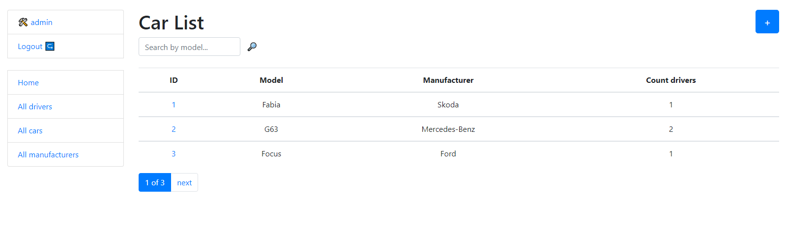

# Taxi Service Project

Django project for managing cars and drivers in the taxi service.

## Check it out!

[Taxi service project deployed to Heroku](###)

## Installation

Python3 must be already installed

```shell
git clone https://github.com/Serhii-Leonenko/taxi-service
cd library-mate
python3 -m venv venv
source venv/bin/activate
pip install -r requirements.txt
python manage.py runserver  # starts Django Server
```

## Features

* Authentication functionality for Driver/User
* Managing car drivers & manufacturers directly from website interface
* Powerful admin panel for advanced managing

## Demo

